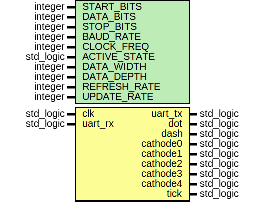

# Entity: top 
- **File**: top.vhd

## Diagram

## Generics

| Generic name | Type      | Value      | Description |
| ------------ | --------- | ---------- | ----------- |
| START_BITS   | integer   | 1          | Allows easy changes between UART standards.            |
| DATA_BITS    | integer   | 8          | Allows easy changes between UART standards.            |
| STOP_BITS    | integer   | 1          | Allows easy changes between UART standards.            |
| BAUD_RATE    | integer   | 9600       | Allows easy changes between UART standards.            |
| CLOCK_FREQ   | integer   | 33_300_000 | Frequency of the FPGA main clock.            |
| ACTIVE_STATE | std_logic | '0'        | Allows easy change between inverted and regular UART.            |
| DATA_WIDTH   | integer   | 8          | Sets width of circular buffer. Set as either 7 or 8 depending on Ascii/UART standard.            |
| DATA_DEPTH   | integer   | 64         | Sets depth of circular buffer. The amount of chars that can be stored at one time.            |
| REFRESH_RATE | integer   | 600        | Seven segment total refresh rate in Hz. 600/5 = 120 Hz overall.             |
| UPDATE_RATE  | integer   | 1          | How fast the morse character displayed changes.            |

## Ports

| Port name | Direction | Type      | Description |
| --------- | --------- | --------- | ----------- |
| clk       | in        | std_logic | Clock input.            |
| uart_rx   | in        | std_logic | UART Rx            |
| uart_tx   | out       | std_logic | UART Tx. This is internally linked to RX to allow for easy debugging.            |
| dot       | out       | std_logic | Used to control seven segment dot.            |
| dash      | out       | std_logic | Used to control seven segment dash (section d).            |
| cathode0  | out       | std_logic | Used to select cathode0.            |
| cathode1  | out       | std_logic | Used to select cathode1.            |
| cathode2  | out       | std_logic | Used to select cathode2.            |
| cathode3  | out       | std_logic | Used to select cathode3.            |
| cathode4  | out       | std_logic | Used to select cathode4.            |
| tick      | out       | std_logic | Debugging signal.           |

## Instantiations

- rx_inst: work.uart_rx(behavioural)
- rx_fifo_inst: work.circularfifobuffer(behavioural)
- tx_inst: work.uart_tx(behavioural)
- tx_fifo_inst: work.circularfifobuffer(behavioural)
- display_clk_inst: work.clock_div(behavioural)
- char_to_morse_7seg_inst: work.char_to_morse_7seg(behavioural)
- display_inst: work.morse_display(behavioural)
